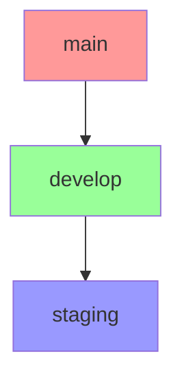
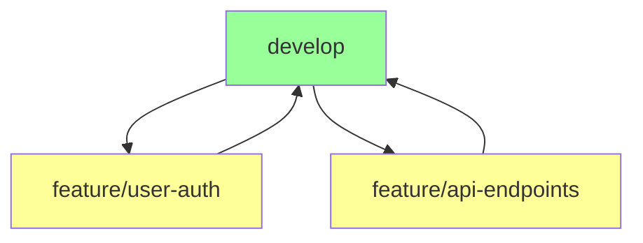
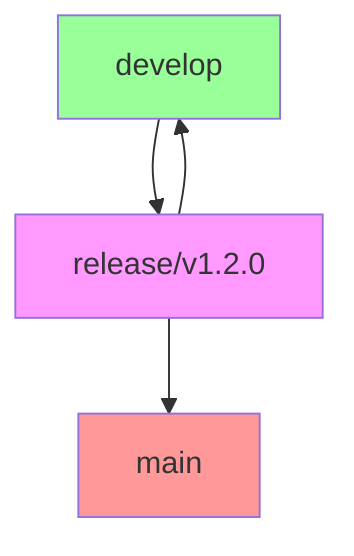
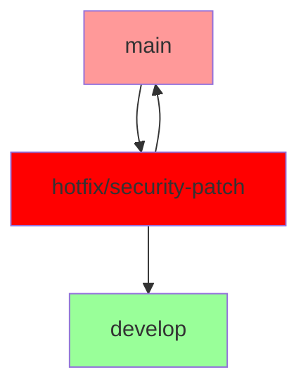

# TJL Project Setup Tool

<div align="center">

[](https://github.com/TechJam-Labs/tjl-project-setup/releases)
[](LICENSE)
[](https://github.com/TechJam-Labs/tjl-project-setup/pulls)

*Enterprise-grade project initialization and management system*

[Installation](#installation) • 
[Documentation](docs/README.md) • 
[Issues](https://github.com/TechJam-Labs/tjl-project-setup/issues)

</div>

---

## 📋 Table of Contents

1. [Introduction](#introduction)
2. [Repository Strategy](#repository-strategy)
3. [Installation](#installation)
4. [Quick Start](#quick-start)
5. [Project Structure](#project-structure)
6. [Environment Management](#environment-management)
7. [Version Control](#version-control)
8. [CI/CD Integration](#cicd-integration)
9. [Documentation](#documentation)
10. [Troubleshooting](#troubleshooting)
11. [Contact & Support](#contact--support)

---

## 🎯 Introduction

### Purpose

The TJL Project Setup Tool is designed to establish a standardized, enterprise-grade project initialization and management system. It implements industry best practices for:

- 🏗️ **Project Structure Organization**
  - Standardized directory layouts
  - Consistent file naming conventions
  - Clear separation of concerns

- 🌍 **Environment Management**
  - Multiple environment configurations
  - Easy environment switching
  - Secure credential management

- 📦 **Version Control**
  - Git workflow automation
  - Branch management
  - Release tracking

- 🚀 **Release Management**
  - Versioning strategy
  - Release automation
  - Changelog generation

- 🔄 **Continuous Integration/Deployment**
  - Automated testing
  - Deployment pipelines
  - Quality assurance

### Benefits

- ✨ **Consistent Project Structure**
  - Unified layout across teams
  - Clear organization
  - Easy navigation

- 📈 **Standardized Development Workflow**
  - Defined processes
  - Quality controls
  - Team collaboration

- ⚡ **Automated Environment Management**
  - Quick environment switching
  - Configuration management
  - Reduced setup time

- 🔒 **Integrated Version Control**
  - Best practices enforcement
  - Security measures
  - Code quality

- 🚀 **Streamlined Release Process**
  - Automated releases
  - Version tracking
  - Documentation generation

- 💻 **Cross-Platform Compatibility**
  - Windows support
  - Linux support
  - macOS support

---

## 🌿 Repository Strategy

### Branch Strategy

#### Main Branches

<details>
<summary>Core Branches Overview</summary>



</details>

- `main`
  - Production-ready code
  - Protected branch
  - Release tags only

- `develop`
  - Main development branch
  - Feature integration
  - Pre-release testing

- `staging`
  - Pre-production testing
  - Integration verification
  - Release candidates

#### Feature Branches

<details>
<summary>Feature Branch Workflow</summary>



</details>

- Format: `feature/[feature-name]`
- Branch from: `develop`
- Merge to: `develop`
- Naming convention:
  - Lowercase
  - Hyphen-separated
  - Descriptive
  - Example: `feature/user-authentication`

#### Release Branches

<details>
<summary>Release Branch Workflow</summary>



</details>

- Format: `release/v[major].[minor].[patch]`
- Branch from: `develop`
- Merge to: `main` and `develop`
- Example: `release/v1.2.0`
- Purpose:
  - Version bumping
  - Last-minute fixes
  - Documentation updates

#### Hotfix Branches

<details>
<summary>Hotfix Branch Workflow</summary>



</details>

- Format: `hotfix/[issue-identifier]`
- Branch from: `main`
- Merge to: `main` and `develop`
- Example: `hotfix/security-patch-123`
- Purpose:
  - Critical bug fixes
  - Security patches
  - Emergency updates

### Git Tags

#### Release Tags

1. **Annotated Tags** (for releases)
   ```bash
   git tag -a v1.2.0 -m "Release version 1.2.0"
   ```
   - Include version number
   - Detailed release notes
   - Signed by release manager
   - Example message:
     ```
     Release version 1.2.0
     
     Features:
     - User authentication
     - API endpoints
     - Database migrations
     
     Breaking Changes:
     - Updated API response format
     ```

2. **Lightweight Tags** (for internal tracking)
   ```bash
   git tag build-2023-02-19
   ```
   - Build identifiers
   - Development milestones
   - Internal versions
   - Quick reference points

#### Tag Naming Convention

| Type | Format | Example |
|------|---------|---------|
| Release | `v[major].[minor].[patch]` | `v1.2.0` |
| Build | `build-[YYYY-MM-DD]` | `build-2023-02-19` |
| Alpha | `v[version]-alpha.[number]` | `v1.2.0-alpha.1` |
| Beta | `v[version]-beta.[number]` | `v1.2.0-beta.2` |
| RC | `v[version]-rc.[number]` | `v1.2.0-rc.1` |

### Commit Strategy

#### Commit Message Format

```
[type]: Brief description

Detailed explanation

BREAKING CHANGE: description
```

#### Commit Types

| Type | Description | Example |
|------|-------------|---------|
| `feat` | New feature | `feat: add user authentication` |
| `fix` | Bug fix | `fix: correct password hashing` |
| `docs` | Documentation | `docs: update API endpoints` |
| `style` | Formatting | `style: format according to style guide` |
| `refactor` | Code restructuring | `refactor: simplify auth logic` |
| `test` | Testing | `test: add unit tests for auth` |
| `chore` | Maintenance | `chore: update dependencies` |

#### Example Commit Message

```
feat: implement user authentication

- Add password hashing
- Create JWT token generation
- Set up authentication middleware
- Add user session management

BREAKING CHANGE: Authentication now requires JWT tokens
```

### Branch Protection Rules

#### Main Branch Protection

- ✓ Require pull request reviews
  - Minimum 2 reviewers
  - Dismiss stale reviews
  - Require re-review after pushes

- ✓ Require status checks
  - CI/CD pipeline must pass
  - All tests must pass
  - Code coverage requirements met

- ✓ No direct pushes
  - All changes via pull requests
  - Branch must be up to date

- ✓ Signed commits required
  - GPG signature verification
  - Authenticated commits only

#### Develop Branch Protection

- ✓ Require pull request reviews
  - Minimum 1 reviewer
  - Technical lead approval

- ✓ Status checks required
  - Build must pass
  - Tests must pass

- ✓ Linear history enforced
  - No merge commits
  - Clean git history

## 💻 Installation

### Prerequisites

| Requirement | Version | Purpose |
|------------|---------|----------|
| Python | ≥ 3.6 | Core runtime |
| Git | ≥ 2.22 | Version control |
| Bash/PowerShell | Latest | Script execution |

### Platform-Specific Installation

<details>
<summary>Windows Installation</summary>

```batch
# Clone repository
git clone https://github.com/TechJam-Labs/tjl-project-setup.git

# Create tools directory
mkdir C:\Tools

# Copy files
copy tjl-project.py C:\Tools
copy tjl-project.bat C:\Tools

# Add to PATH (PowerShell Admin)
[Environment]::SetEnvironmentVariable(
    "Path",
    [Environment]::GetEnvironmentVariable("Path", "Machine") + ";C:\Tools",
    "Machine"
)

# Verify installation
tjl-project --version
```

#### PowerShell Profile Integration
```powershell
# Add to $PROFILE
function New-TJLProject {
    param($projectName)
    python "C:\Tools\tjl-project.py" $projectName $args
}
Set-Alias tjl New-TJLProject
```
</details>

<details>
<summary>Linux Installation</summary>

```bash
# Clone repository
git clone https://github.com/TechJam-Labs/tjl-project-setup.git

# Create installation directory
mkdir -p ~/.local/bin

# Copy and make executable
cp tjl-project.py ~/.local/bin/tjl-project
chmod +x ~/.local/bin/tjl-project

# Add to PATH (add to ~/.bashrc)
echo 'export PATH="$HOME/.local/bin:$PATH"' >> ~/.bashrc
source ~/.bashrc

# Verify installation
tjl-project --version
```

#### Shell Completion
```bash
# Add to ~/.bashrc
_tjl_project_completion() {
    local cur=${COMP_WORDS[COMP_CWORD]}
    local opts="--path --environments --template --help"
    COMPREPLY=( $(compgen -W "$opts" -- $cur) )
}
complete -F _tjl_project_completion tjl-project
```
</details>

<details>
<summary>macOS Installation</summary>

```bash
# Install dependencies (if needed)
brew install python git

# Clone repository
git clone https://github.com/TechJam-Labs/tjl-project-setup.git

# Create installation directory
mkdir -p ~/.local/bin

# Copy and make executable
cp tjl-project.py ~/.local/bin/tjl-project
chmod +x ~/.local/bin/tjl-project

# Add to PATH (add to ~/.zshrc)
echo 'export PATH="$HOME/.local/bin:$PATH"' >> ~/.zshrc
source ~/.zshrc

# Verify installation
tjl-project --version
```
</details>

<details>
<summary>Docker Installation</summary>

```dockerfile
# Dockerfile
FROM python:3.9-slim

RUN apt-get update && \
    apt-get install -y git && \
    apt-get clean && \
    rm -rf /var/lib/apt/lists/*

COPY tjl-project.py /usr/local/bin/tjl-project
RUN chmod +x /usr/local/bin/tjl-project

WORKDIR /workspace
ENTRYPOINT ["tjl-project"]
```

```bash
# Build and use
docker build -t tjl-project .
docker run -v "$(pwd):/workspace" tjl-project
```
</details>

## 🚀 Quick Start

### Basic Usage

```bash
# Create new project
tjl-project my-project

# Specify custom path
tjl-project my-project --path /custom/path

# Custom environments
tjl-project my-project --environments local,dev,qa,staging,prod

# Use project template
tjl-project my-project --template microservice
```

### Project Templates

| Template | Description | Usage |
|----------|-------------|-------|
| `basic` | Basic project structure | `--template basic` |
| `microservice` | Microservice architecture | `--template microservice` |
| `webapp` | Web application | `--template webapp` |
| `library` | Reusable library | `--template library` |

## 📁 Project Structure

### Default Structure

```
project-name/
├── .github/
│   └── workflows/
│       ├── ci.yml
│       └── release.yml
├── config/
│   ├── local/
│   │   ├── env.conf
│   │   └── settings.json
│   ├── dev/
│   ├── staging/
│   └── prod/
├── docs/
│   ├── api/
│   ├── setup/
│   └── README.md
├── scripts/
│   ├── switch_env.sh
│   ├── deploy.sh
│   └── setup.sh
├── src/
│   ├── core/
│   ├── modules/
│   └── utils/
├── tests/
│   ├── unit/
│   ├── integration/
│   └── e2e/
├── tools/
│   ├── linters/
│   └── generators/
├── .gitignore
├── .editorconfig
├── README.md
└── requirements.txt
```

### Directory Purposes

| Directory | Purpose | Contents |
|-----------|---------|-----------|
| `.github/` | CI/CD workflows | GitHub Actions configurations |
| `config/` | Environment configs | Environment-specific settings |
| `docs/` | Documentation | Project documentation, API docs |
| `scripts/` | Utility scripts | Automation and management scripts |
| `src/` | Source code | Application source code |
| `tests/` | Test files | All test categories |
| `tools/` | Development tools | Linters, generators, etc. |

## 🌍 Environment Management

### Environment Configuration

```bash
# Switch environment
./scripts/switch_env.sh dev

# Load environment
source config/dev/env.conf

# Check current environment
echo $CURRENT_ENV
```

### Environment Variables

```ini
# config/dev/env.conf example
export APP_ENV=development
export DEBUG=true
export API_URL=https://api.dev.example.com
export DB_HOST=localhost
export DB_PORT=5432
```

### Environment-Specific Settings

```json
// config/dev/settings.json example
{
  "logging": {
    "level": "DEBUG",
    "format": "detailed"
  },
  "services": {
    "cache": {
      "provider": "redis",
      "host": "localhost",
      "port": 6379
    }
  }
}
```

## 🔄 Version Control Best Practices

### Git Configuration

```bash
# Configure Git
git config --global user.name "Your Name"
git config --global user.email "your@email.com"

# Set default branch
git config --global init.defaultBranch main

# Configure line endings
git config --global core.autocrlf true  # Windows
git config --global core.autocrlf input # Linux/macOS
```

### Pre-commit Hooks

```yaml
# .pre-commit-config.yaml
repos:
  - repo: https://github.com/pre-commit/pre-commit-hooks
    rev: v4.4.0
    hooks:
      - id: trailing-whitespace
      - id: end-of-file-fixer
      - id: check-yaml
      - id: check-added-large-files
```

## 🚢 CI/CD Integration

### GitHub Actions Workflow

```yaml
# .github/workflows/ci.yml
name: CI/CD Pipeline

on:
  push:
    branches: [ main, develop ]
  pull_request:
    branches: [ main, develop ]

jobs:
  test:
    runs-on: ubuntu-latest
    steps:
      - uses: actions/checkout@v2
      
      - name: Set up Python
        uses: actions/setup-python@v2
        with:
          python-version: '3.9'
          
      - name: Run tests
        run: |
          python -m pip install --upgrade pip
          pip install -r requirements.txt
          python -m pytest tests/
          
  deploy:
    needs: test
    runs-on: ubuntu-latest
    if: github.ref == 'refs/heads/main'
    steps:
      - uses: actions/checkout@v2
      
      - name: Deploy
        run: |
          echo "Add deployment steps here"
```

## 📚 Documentation

### API Documentation

```bash
# Generate API documentation
./scripts/generate_docs.sh
```

### Development Guides

- [Installation Guide](docs/installation.md)
- [Quick Start Guide](docs/quickstart.md)
- [Contributing Guide](CONTRIBUTING.md)
- [API Reference](docs/api/README.md)

## ❓ Troubleshooting

<details>
<summary>Common Issues</summary>

### Installation Issues
```bash
# Permission issues
sudo chown -R $USER:$USER ~/.local/bin
chmod +x ~/.local/bin/tjl-project

# PATH issues
echo $PATH
```

### Git Issues
```bash
# Reset Git configuration
git config --global --unset-all

# Clean Git state
git clean -fdx
```

### Environment Issues
```bash
# Check environment
echo $CURRENT_ENV

# Reset environment
unset CURRENT_ENV
source config/local/env.conf
```
</details>

## 📞 Contact & Support

### Technical Support
- **Email**: ben@techjamlabs.com
- **Phone**: +2348099999928
- **Issues**: [GitHub Issues](https://github.com/TechJam-Labs/tjl-project-setup/issues)

### Documentation & Resources
- [Complete Documentation](docs/README.md)
- [Contributing Guidelines](CONTRIBUTING.md)
- [Code of Conduct](CODE_OF_CONDUCT.md)

---

<div align="center">

Made with ❤️ by Ben Adenle | [TechJam Labs](https://techjamlabs.com)

</div>
